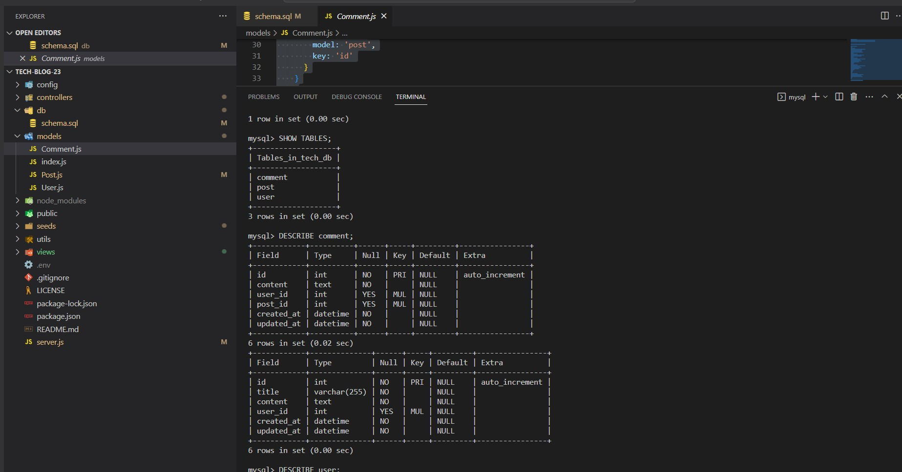
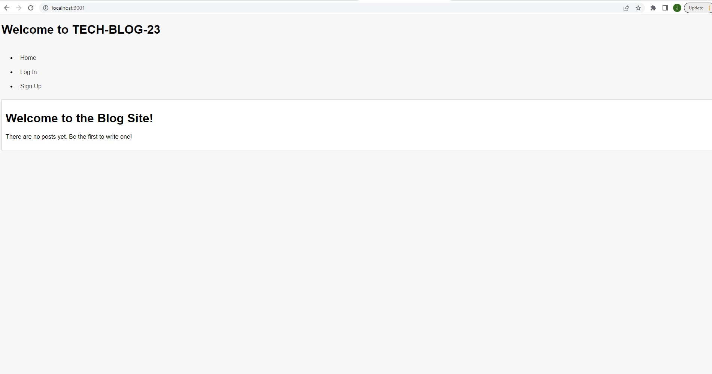

# Tech-Blog-23

## Table of Contents

[Description](#description)
[Installation](#installation)
[Test](#test)
[Usage](#usage)
[E-mail](#email)
[Github](#github)
[License](#license)

### Description

AS A developer who writes about tech
I WANT a CMS-style blog site
SO THAT I can publish articles, blog posts, and my thoughts and opinions

### Installation

### Usage:

### Screenshot:

### Questions? E-mail

juang1908@icloud.com

### Github Username:

Juang1908

    ### License
    For more information about this license please visit
    [MIT License](https://opensource.org/)
